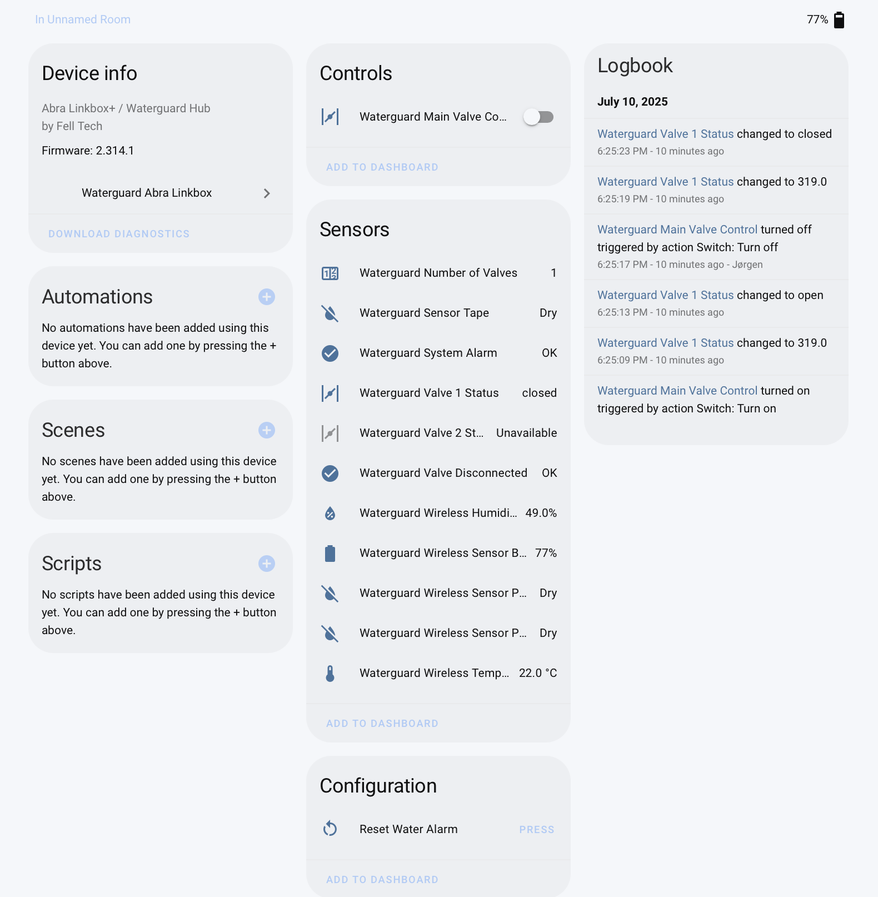

# Abra Waterguard Linkbox+ Integration for Home Assistant

This is a custom integration for Home Assistant to integrate with the Waterguard ABRA life Linkbox+ water stop system. It allows you to monitor the status of your Waterguard system, control the main valve, and receive notifications for alarms and other events.



## Features

-   **Local Polling**: Communicates directly with your Waterguard Linkbox+ hub on your local network. No cloud connection is required.
-   **Real-time Monitoring**: Monitors the status of the main valve, sensor tape, and wireless sensors.
-   **Valve Control**: Open and close the main water valve from Home Assistant.
-   **Alarm Notifications**: Receive notifications for water leaks, valve disconnections, and low battery on wireless sensors.
-   **Diagnostic Tools**: Includes a service to run diagnostics on your Waterguard system, including wireless connectivity tests.

## Integration State

##### Known to work/tested setup:
-   **Hub**: Abra/Waterguard linkbox+ 4G
-   **Valve(s)**: 1 connected valve, standard Abra supplied.
-   **Wireless sensors**: Wireless Abra leak sensor with connected sensor strip.
-   **Other**: Hard wired sensor strip to the hub.

##### Not tested
-   **Wireless sensors**: I have currently not tested cases with multiple wireless sensors. I have also not been able to verify what/if other wireless sensors connected to the abra hub will work with this integration.
-   **Multiple valves**: My current setup consists of one connected valve, in essennce this means that multi-valve setups have not been tested.

##### Known bugs
-   **Device properties**: As of now, i suspect that there is a bacnet device specific bug, that hinders the device from communicating device properties. This has no implication on the integrations functionality, but hinders device recognition somewhat, as well as getting the properties for information purposes.

## Installation

### HACS (Recommended)
1. Add this repository as a custom repository in HACS:
   - Go to HACS > Integrations
   - Click the three dots in the upper right corner
   - Select "Custom repositories"
   - Add the URL `https://github.com/joergenwold/abra-waterguard-linkbox-ha`
   - Select "Integration" as the category
   - Click "Add"
2. Find and install "Abra Waterguard Linkbox+" from HACS
3. Restart Home Assistant

### Manual Installation
1.  Copy the `custom_components/waterguard_linkbox` directory to your Home Assistant `custom_components` directory.
2.  Restart Home Assistant.
3.  Go to **Settings** > **Devices & Services** and click **Add Integration**.
4.  Search for "Waterguard Linkbox+" and follow the on-screen instructions.

> **Note**: You will need to know the IP of your Linkbox+ device.

## Configuration & Setup Flow

The integration supports both automatic discovery and manual configuration through the Home Assistant UI.

### Configuration Flow


1.  **IP Address Input**: First, you'll be asked to enter the IP address and port of your Waterguard hub.
2.  **Device ID Discovery**: The integration will attempt to discover available device IDs for the specified IP address.
3.  **Device ID Selection**: If device IDs are found, you can select from the discovered list or choose to enter manually.
4.  **Manual Device ID**: If no device IDs are discovered, or if you choose manual entry, you can enter the device ID manually.

### Automatic Discovery

1.  When you add the integration, it will automatically scan your local network for Waterguard hubs using a BACnet broadcast request.
2.  If any hubs are found, they will be presented in a list showing their IP address and device ID.
3.  Select your hub from the list to complete the setup.

### Manual Configuration

If device ID discovery fails, you can still configure the integration manually by providing:
-   **IP Address**: The local IP address of your Waterguard hub.
-   **Port**: The BACnet port (default is `47808`).
-   **Device ID**: The BACnet device instance ID of your hub (e.g., `2229704` or `131120`).

### Network Requirements
-   **Direct IP Access**: For manual setup, the Home Assistant server must be able to reach the Waterguard Linkbox+ hub directly via its IP address.
-   **Broadcast for Discovery**: For automatic discovery, your network must allow UDP broadcast packets on port 47808 between Home Assistant and the hub. This typically means they should be on the same VLAN/subnet.
-   **No Firewalls**: Ensure no firewalls are blocking UDP traffic on port 47808.

## Entities

The integration creates the following entities:

#### Binary Sensors

-   **Waterguard System Alarm**: Indicates if the system alarm is active.
-   **Waterguard Sensor Tape**: Indicates if a water leak is detected by the hub sensor tape.
-   **Waterguard Valve Disconnected**: Indicates if the main valve is disconnected from the hub.
-   **Waterguard Wireless Sensor Point 1**: Indicates if a water leak is detected by the first wireless sensor point.
-   **Waterguard Wireless Sensor Point 2**: Indicates if a water leak is detected by the second wireless sensor point.

#### Sensors

-   **Waterguard Number of Valves**: The number of valves connected to the system.
-   **Waterguard Valve 1 Status**: The status of the first valve (e.g., open, closed, disconnected).
-   **Waterguard Valve 2 Status**: The status of the second valve (if present).
-   **Waterguard Wireless Temperature**: The temperature measured by the wireless sensor.
-   **Waterguard Wireless Humidity**: The humidity measured by the wireless sensor.
-   **Waterguard Wireless Sensor Battery**: The battery level of the wireless sensor.

#### Switches

-   **Waterguard Main Valve Control**: Allows you to open and close the main water valve.

#### Buttons

-   **Reset Water Alarm**: Resets the water alarm after it has been triggered.

## Services

The integration provides the following service:

-   `waterguard_linkbox.run_diagnostics`: Runs a  diagnostic test on your Waterguard system. This service also includes a wireless connectivity test for your wireless sensors and provides logs and as a persistent notification.


## Notifications

The integration can send notifications for the following events:

-   **Water Alarm**: When a water leak is detected by the sensor tape or a wireless sensor.
-   **Valve Alarm**: When the main valve is disconnected from the hub.
-   **Low Battery**: When the battery level of a wireless sensor is low.
-   **Connection Lost**: When the connection to the Waterguard hub is lost.

> **Note**: Notification settings are managed via the integration's options/configuration flow.

## FAQ

**Q: My hub is not discovered automatically. What should I do?**  
A: If the integration cannot find your hub, you can add it via the manual configuration flow. You will need to know your hub's IP Address and Device ID. Ensure your network allows UDP traffic on port 47808, as firewalls can block discovery.

**Q: What does a device ID for Waterguard Linkbox+ look like?**  
A: Device IDs are typically numbers like `2229704`, `131120`, or `12345`. This ID is unique to your device on the BACnet network. If all else fails, try ID `1`

**Q: I don't see wireless sensor data.**  
A: Wireless sensors are battery-powered and sleep to conserve energy, reporting data intermittently. If data is consistently missing, use the diagnostics service to check wireless connectivity.

**Q: How do I reset a water alarm?**  
A: Use the "Reset Water Alarm" button entity created by the integration.

**Q: Why does my valve show as disconnected?**  
A: Check the physical connection between the valve and the hub. The valve may be unplugged or there may be a wiring issue. You could also verify the state of the valve through the Abra app.

**Q: How do I change notification settings?**  
A: Notification settings (persistent, mobile) are managed via the integration's options/configuration flow in the Home Assistant UI.

## Developer & Debugging

This integration includes two helper scripts for development and debugging purposes. These are not needed for normal operation but can be useful for troubleshooting or development.

-   `discover_device_id.py`: This script sends a BACnet broadcast discovery packet to the network to find the Device ID of your Linkbox+. If you don't know your Device ID, you can run this script from the command line to find it.

    ```bash
    python3 discover_device_id.py
    ```

-   `test_device_communication.py`: This script allows you to test the BACnet communication with the Linkbox+ and see the raw responses from the device. This is useful for debugging parsing issues or testing new BACnet objects. You will need to edit the script to set the IP address and Device ID of your hub.

## Credits

- Developed by [@jorgenwold](https://github.com/jorgenwold)
- Waterguard and Abra Linkbox+ are trademarks of Fell Tech.
- Fell Tech Support: [https://felltech.no/](https://felltech.no/)

## License

This project is licensed under the MIT License - see the [LICENSE](LICENSE) file for details.